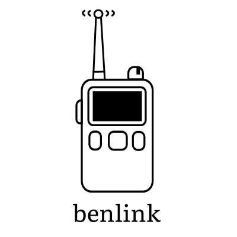

# benlink

[](https://www.repostatus.org/#wip)



<!-- BEGIN CONTENT -->

`benlink` is a Python library for communicating with and controlling Benshi
radios (e.g. Vero VR-N76, RadioOddity GA-5WB, BTech UV-Pro) over BLE.

In addition to providing a high-level async Python interface for controlling
Benshi radios, the larger goal of this project is to document their BLE
protocol. An understanding of the BLE protocol used by these radios will empower
Benshi radio owners and the wider open source community to:

1. Control their radios without relying on proprietary apps or software.

2. Extend the functionality of their radios through custom software and
   integrations.

3. Preserve the usability of their radios, even when the official "HT" app is no
   longer supported or updated.

It is a work in progress and is nowhere close to feature complete.
[Pull requests](https://github.com/khusmann/benlink) are welcome!

### Radio Support

The following radios should work with this library:

- BTech UV-Pro
- RadioOddity GA-5WB
- Vero VR-N76 (untested)
- Vero VR-N7500 (untested)
- BTech GMRS-Pro (untested)

If you know of other radios that use the same Benshi BLE protocol, please
[open an issue](https://github.com/khusmann/benlink/issues) to let me know!

## Installation

I plan to publish this package on PyPI once it is more complete. For now, clone
the repo and install it locally:

```bash
pip install .
```

(If you are developing the package, you can use `pip install -e .` to install it
in "editable" mode.)

## Quick Start

First, make sure your radio is paired with your computer, and get its device
UUID (e.g. `XX:XX:XX:XX:XX:XX`).

The following will connect to the radio and print its device info:

```python
import asyncio
from benlink import RadioController

async def main():
    async with RadioController("XX:XX:XX:XX:XX:XX") as radio:
        print(radio.device_info)

asyncio.run(main())
```

## Next Steps

To see what else you can do with this library, check out the examples in the
`benlink.controller` module documentation.

# Known issues

If you try to send any data with
`benlink.controller.RadioController.send_tnc_data` it will immediately reply
with a `INCORRECT_STATE` error. If you immediately retry the command within two
seconds, it will work. I have no idea why it does this. In all of my btsnoop
logs of the official app, the command appears to work on the first try. If
anyone can figure out what's going on here, please reply to
[this open issue](https://github.com/khusmann/benlink/issues/1)!

Edit 2024-12-25: I think I have figured it out -- you have to be connected to
the rfcomm audio channel in order for it to be in the "correct state". Will
continue to investigate...

In any case, at some point I plan to add a higher-level interface for sending /
receiving TNC data that will automatically retry failed commands and queue /
combine message fragments.

## Roadmap

Things to do:

- [ ] Make a higher-level interface for sending / receiving TNC data (auto
      retry, queue message fragments)
- [ ] Implement audio sending / receiving (looks like this can only be done over
      rfcomm?)
- [ ] Implement more commands and settings
- [ ] Find more radios that use this protocol and test them with this library
- [ ] Figure out firmware flashing process / protocol (this is key for long-term
      independence from the HT app)

## Disclaimer

This project is an independent grassroots effort, and is **not** affiliated with
or endorsed by Benshi, Vero, RadioOddity, BTech, or any other company.

Use this library at your own risk. I am **not** responsible for any damage
caused to your radio or any other equipment while using this library.
